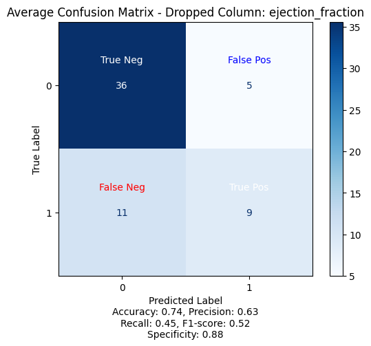

<script id="MathJax-script" async src="https://cdn.jsdelivr.net/npm/mathjax@3/es5/tex-mml-chtml.js"></script>

## My Project

I applied machine learning techniques to investigate a dataset containing health data from 299 patients. In particular, I used Logistic Regression to build a predictive model for the risk of fatal heart attack. I then built a simple user interfce where the user (i.e. a medical professional) can input patient-specific health data and determine whether said patient is at risk of a fatal heart attack. 

***

## Abstract 

Heart attacks are widely known to be the most common cause of death across most demographics. Hence, being able to predict the risk of a heart attack is extremely important in the medical field and models that successfully accomplish this can potentially save many lives. The following analysis of Chicco and Jurman's "Heart Failure Prediction" dataset [1] shows that heart failure can be predicted using a patient's age, ejection fraction, blood pressure (low/high), and serum creatinine value only. Including all features results in an arguable worse predictive model, since accuracy drops from 0.75 to 0.74 and precision drops from 0.73 to 0.63.

## Data

The dataset includes health data from 299 patients who all already had left ventricular disfunction and had a history of non-fatal heart failure [2]. There are input 12 features, and one output feature being whether the patient died of heart failure in the period between that appointment and the follow-up appointment. Here is a description of the input features:
* age: patient's age
* anaemia: decrease of red blood cells or hemoglobin (boolean)
* creatinine phosphokinase : level of the CPK enzyme in the blood (mcg/L)
* diabetes: if the patient has diabetes (boolean)
* ejection fraction: percentage of blood leaving the heart at each contraction, with 50-70% generally being considered as healthy
* high blood pressure: if the patient has hypertension (boolean)
* platelets: platelets in the blood (kiloplatelets/mL)
* serum creatinine: level of serum creatinine in the blood (mg/dL)
* serum sodium: level of serum sodium in the blood (mEq/L)
* sex: patient's sex (binary)
* smoking: whether patient smokes or not (boolean)
* time: follow up period in between appointments

A patient was considered to have anaemia if the haematocrit levels were lower than 36%. No clear description was given for how they differentiated between low and high blood pressure [2].

Table 1 below shows a table summary of the dataset:

|index|age|anaemia|creatinine\_phosphokinase|diabetes|ejection\_fraction|high\_blood\_pressure|platelets|serum\_creatinine|serum\_sodium|sex|smoking|time|DEATH\_EVENT|
|---|---|---|---|---|---|---|---|---|---|---|---|---|---|
|count|299\.0|299\.0|299\.0|299\.0|299\.0|299\.0|299\.0|299\.0|299\.0|299\.0|299\.0|299\.0|299\.0|
|mean|60\.83|0\.43|581\.84|0\.42|38\.08|0\.35|263358\.03|1\.39|136\.63|0\.65|0\.32|130\.26|0\.32|
|std|11\.89|0\.5|970\.29|0\.49|11\.83|0\.48|97804\.24|1\.03|4\.41|0\.48|0\.47|77\.61|0\.47|
|min|40\.0|0\.0|23\.0|0\.0|14\.0|0\.0|25100\.0|0\.5|113\.0|0\.0|0\.0|4\.0|0\.0|
|25%|51\.0|0\.0|116\.5|0\.0|30\.0|0\.0|212500\.0|0\.9|134\.0|0\.0|0\.0|73\.0|0\.0|
|50%|60\.0|0\.0|250\.0|0\.0|38\.0|0\.0|262000\.0|1\.1|137\.0|1\.0|0\.0|115\.0|0\.0|
|75%|70\.0|1\.0|582\.0|1\.0|45\.0|1\.0|303500\.0|1\.4|140\.0|1\.0|1\.0|203\.0|1\.0|
|max|95\.0|1\.0|7861\.0|1\.0|80\.0|1\.0|850000\.0|9\.4|148\.0|1\.0|1\.0|285\.0|1\.0|

Figure 1 below, instead, shows a visual depiction of each feature's distribution:

{: width="500" }
*Figure 1: Histogram distribution of all features in the dataset [1].*

It must be mentioned that DEATH_EVENT, the target output variable, is slightly class imbalanced since there are twice as many patients who did not experience heart failure than patients who did.

## Preprocessing

Firstly, I converted all the non-integer data to integer. 

I then performed feature ranking for Linear Regression. The results of the feature ranking showed that the 'time' feature dominated over all others by far. This is because a longer follow-up period, for a patient with pregressed heart issues, means a longer period of time during which new issues can arise. I then decided to remove the 'time' feature from the analysis. Since the aim of the project is to predict the chance of a fatal heart failure at the first appointment, it would be counterintuitive to include the length of the follow up period in the analysis.

## Modelling

For the machine learning model, I chose to use Logistic Regression since the target output variable is a boolean (classification problem). I considered using Random Forest Regression, but given the small size of the dataset, this resulted in very low R^2 scores. To contrast this, I tried increasing the maximum depth of the Random Forest, but this ultimately just resulted in the model overfitting the training data. 

I set the number of iteration at 20000 in order for all features to converge. I implemented k-fold cross validation in the model in order to make it more robust and reduce overfitting. I chose a 5 fold cross validation method, specifically. 

After removing the 'time' feature, I performed feature ranking again. The method chosen for feature ranking was Recursive Feature Elimination (RFE), whereby one feature at the time is removed from the model with replacement and the features yielding the greatest negative impact when removed are deemed to be the most important ones. 

The standout features in terms of importance were ejection fraction and serum creatinine. Once the important features were identified, I dropped all other features from the dataset and I compared the confusion matrices and ROC curves of the model with all features and with the interest features only.

Finally, I built a simple user interface to make predictions using the model with the important features only.

## Results

Below is the list of features ranked from least important to most important based on the R^2 test score they produced when using the RFE method:
* Column: diabetes, Test R^2 score: 0.756
* Column: serum_sodium, Test R^2 score: 0.756
* Column: smoking, Test R^2 score: 0.753
* Column: anaemia, Test R^2 score: 0.749
* Column: high_blood_pressure, Test R^2 score: 0.746
* Column: creatinine_phosphokinase, Test R^2 score: 0.742
* Column: age, Test R^2 score: 0.739
* Column: platelets, Test R^2 score: 0.736
* Column: sex, Test R^2 score: 0.736
* Column: serum_creatinine, Test R^2 score: 0.709
* Column: ejection_fraction, Test R^2 score: 0.699

Figure 2 below shows a visual depiction of each feature's importance. In the histogram, shorter columns represent more important features, since the R^2 score was worse when these features were removed:

{: width="500" }
*Figure 2: Feature importances [1].*

I then compared the performance of the model with all features included to the model with only ejection fraction and serum creatinine included. Below are the confusion matrices for both:

{: width="500" }
*Figure 3: Confusion matrix for model with all features included [1].*

{: width="500" }
*Figure 4: Confusion matrix for model with only ejection fraction and serum creatinine [1].*

I also plotted the ROC curve for both models, as shown below:

{: width="500" }
*Figure 5: ROC curve for model with all features included [1].*

{: width="500" }
*Figure 6: ROC curve for model with all features included [1].*

## Discussion


## Conclusion


## References
[1] “Heart Failure Prediction.” Kaggle, 20 June 2020, www.kaggle.com/datasets/andrewmvd/heart-failure-clinical-data/data?select=heart_failure_clinical_records_dataset.csv.
[2] Chicco, D., Jurman, G. Machine learning can predict survival of patients with heart failure from serum creatinine and ejection fraction alone. BMC Med Inform Decis Mak 20, 16 (2020). https://doi.org/10.1186/s12911-020-1023-5
[3]

[back](./)

## Notes on stuff to add
* discussion on r^2 to check for overfitting
* effect of changing threshold on increasing recall
* how feature ranking was obtained for LR
* why choosing number of iterations
* why the ROC is jagged
* why 5 folds for kfold cross validation
* discussion of area under the curve for ROC
* extension on calculating proper follow up period with risk factor if given a larger dataset

  <p>
When \(a \ne 0\), there are two solutions to \(ax^2 + bx + c = 0\) and they are
  \[x = {-b \pm \sqrt{b^2-4ac} \over 2a}.\]
</p>


```python

```

